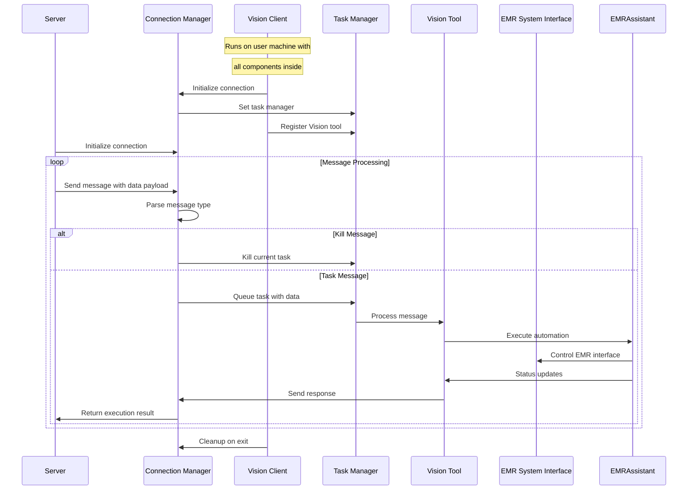
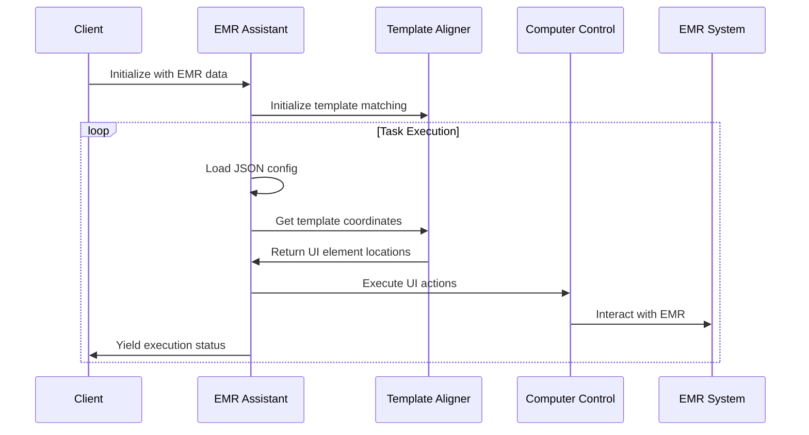

# Client Vision Tool Project Overview

## Table of Contents

1. [Architecture Diagram](#architecture-diagram)
2. [Project Structure](#project-structure)
3. [File Listing](#file-listing)
4. [Component Details](#component-details)
5. [Key Features](#key-features)
6. [Configuration](#configuration)
7. [Running the Application](#running-the-application)

## Architecture Diagram

### Client-Server Communication Flow



### Vision Assistant Process Flow



## Project Structure

```
/
├── .gitignore
├── README.md
├── requirements.txt
├── setup.py
├── data_model_schema.md
├── src/
│   ├── __init__.py
│   ├── client/
│   │   ├── __init__.py
│   │   ├── client.py
│   │   ├── constants.py
│   │   ├── core/
│   │   │   ├── __init__.py
│   │   │   ├── base_tool.py
│   │   │   ├── task_manager.py
│   │   │   └── websocket_manager.py
│   │   ├── tools/
│   │   │   ├── __init__.py
│   │   │   └── vision_tool.py
│   │   └── utils/
│   │       ├── __init__.py
│   │       └── template_manager.py
│   ├── config_generator/
│   │   ├── __init__.py
│   │   ├── generators/
│   │   │   ├── __init__.py
│   │   │   └── config_generator.py
│   │   ├── prompts/
│   │   │   ├── __init__.py
│   │   │   └── prompts.py
│   │   └── speech/
│   │       ├── __init__.py
│   │       ├── exceptions.py
│   │       ├── transcriber.py
│   │       └── utils.py
│   ├── utils/
│   │   ├── __init__.py
│   │   ├── generate_selection_list.py
│   │   ├── input_moniter.py
│   │   └── region_crop_tool.py
│   └── vision_assistant/
│       ├── __init__.py
│       ├── browser/
│       │   ├── __init__.py
│       │   └── browser.py
│       ├── computer/
│       │   ├── __init__.py
│       │   ├── control.py
│       │   └── screen_effect.py
│       ├── data/
│       │   ├── __init__.py
│       │   └── emr_data.py
│       ├── emr_assistant.py
│       └── template_alignment/
│           ├── __init__.py
│           └── template_alignment.py
└── tests/
    ├── test_config_gen.py
    └── test_speech_transcriber.py
```

## File Listing

### Core Files

| File                   | Description                                              |
| ---------------------- | -------------------------------------------------------- |
| `setup.py`             | Package setup for installation and dependency management |
| `.gitignore`           | Git ignore patterns for the project                      |
| `data_model_schema.md` | Entity-relationship diagram for the data model           |

### Client Application

| File                                   | Description                                                          |
| -------------------------------------- | -------------------------------------------------------------------- |
| `src/client/client.py`                 | Main client application entry point with WebSocket connections       |
| `src/client/constants.py`              | Constant definitions for the client, including websocket config      |
| `src/client/core/base_tool.py`         | Abstract base class for tools with queue management                  |
| `src/client/core/task_manager.py`      | Manages execution of multiple tools ensuring only one runs at a time |
| `src/client/core/websocket_manager.py` | Manages WebSocket connection and message routing                     |
| `src/client/tools/vision_tool.py`      | Vision tool implementation for EMR processing                        |
| `src/client/utils/template_manager.py` | Handles EMR template paths and validation                            |

### Vision Assistant Core

| File                                                            | Description                                          |
| --------------------------------------------------------------- | ---------------------------------------------------- |
| `src/vision_assistant/emr_assistant.py`                         | Core EMR automation engine with template handling    |
| `src/vision_assistant/data/emr_data.py`                         | Data container for EMR fields with validation        |
| `src/vision_assistant/template_alignment/template_alignment.py` | Template matching system for UI element detection    |
| `src/vision_assistant/computer/control.py`                      | Computer control functions (mouse/keyboard)          |
| `src/vision_assistant/computer/screen_effect.py`                | Screen overlay for visual feedback during automation |
| `src/vision_assistant/browser/browser.py`                       | Browser interface for monitoring and control         |

### Configuration Generator

| File                                                  | Description                                         |
| ----------------------------------------------------- | --------------------------------------------------- |
| `src/config_generator/generators/config_generator.py` | LLM-based configuration generator                   |
| `src/config_generator/prompts/prompts.py`             | Prompt templates for workflow and config generation |
| `src/config_generator/speech/transcriber.py`          | Speech transcription using Whisper                  |
| `src/config_generator/speech/utils.py`                | Audio processing utilities                          |
| `src/config_generator/speech/exceptions.py`           | Custom exceptions for transcription                 |

### Utilities

| File                                   | Description                                             |
| -------------------------------------- | ------------------------------------------------------- |
| `src/utils/generate_selection_list.py` | Utility to generate selection lists from keys           |
| `src/utils/input_moniter.py`           | Monitors mouse and keyboard input for template creation |
| `src/utils/region_crop_tool.py`        | Tool for cropping screen regions to create templates    |

## Component Details

### Client Architecture

The client application functions as a standalone WebSocket client that connects to a backend server and provides a vision automation toolset for EMR systems:

1. **WebSocketManager**: Handles connection establishment and message routing

   - Maintains connection to the server and reconnects on failure
   - Routes incoming messages to the TaskManager

2. **TaskManager**: Controls task execution flow

   - Manages task queues for each registered tool
   - Ensures only one tool executes at a time
   - Provides task lifecycle management

3. **VisionTool**: Core automation implementation
   - Processes EMR-related tasks received from server
   - Uses EMRAssistant to execute automation tasks
   - Reports status and execution results back to server

### EMR Assistant

The EMR Assistant provides the core functionality for automating EMR systems:

1. **Template-based UI Recognition**:

   - Uses template images to locate UI elements on screen
   - Supports flexible scale matching for different screen resolutions

2. **JSON-driven Configuration**:

   - Loads automation steps from structured JSON files
   - Follows a declarative approach to defining automation workflows

3. **Computer Control Interface**:

   - Simulates human input with mouse and keyboard actions
   - Performs verification steps to ensure correct execution

4. **Data Management**:
   - EMRData container with validation logic
   - Support for patient demographics, insurance, clinical codes
   - Flexible update mechanisms from parsed documents

### Config Generator

The Config Generator provides an LLM-powered workflow for creating automation configurations:

1. **Workflow Narration**:

   - Processes audio transcripts of user narration
   - Generates structured narratives for automation steps
   - Handles variation in terminology and command phrasing

2. **JSON Configuration Generation**:

   - Converts narratives to JSON configuration files
   - Maps described actions to concrete implementation steps
   - Validates output against known schema requirements

3. **Speech Processing**:
   - Transcribes audio recordings using OpenAI Whisper
   - Processes audio with appropriate filtering and normalization
   - Supports different model sizes for varying accuracy needs

## Key Features

- **EMR System Automation**: Automates data entry and form navigation in EMR systems
- **Template-based Computer Vision**: Locates UI elements using template matching
- **WebSocket Client-Server Architecture**: Enables remote control and monitoring
- **LLM-Powered Configuration Generation**: Creates automation scripts from natural language
- **Visual Feedback System**: Provides real-time automation status overlays

## Configuration

The system is configured through several key mechanisms:

1. **EMR Templates Directory Structure**:

```
emr_templates/
├── office_ally/
│   ├── general/
│   │   ├── configs/
│   │   │   └── config.json  # Main configuration
│   │   └── images/
│   │       └── *.png        # Template images
│   ├── patient/
│   │   ├── configs/
│   │   │   └── steps.json   # Patient page automation steps
│   │   └── images/
│   │       └── *.png        # Template images
│   └── visit/
│       ├── configs/
│       │   └── steps.json   # Visit page automation steps
│       └── images/
│           └── *.png        # Template images
└── open_emr/
    └── [similar structure...]
```

2. **Environment Variables**:

```
OPENAI_API_KEY=your_openai_api_key
VISION_ASSISTANT_TEMPLATES=path_to_templates_directory
```

3. **Config Schema**:

```json
{
  "pages": {
    "page_name": {
      "images": "relative/path/to/image/directory",
      "configs": "relative/path/to/config/directory"
    }
  },
  "tasks": {
    "task_name": {
      "initial_page": "page_name",
      "operations": [
        {
          "method": "method_name",
          "args": ["arg1", "arg2"],
          "kwargs": { "key1": "value1" }
        }
      ]
    }
  },
  "task_route": {
    "task_name": ["step1", "step2"]
  }
}
```

## Running the Application

This guide will walk you through setting up and running the Vision Assistant client on your local machine.

### 1. Create a Virtual Environment

First, create a clean Python virtual environment. This isolates the project's dependencies from your system's Python installation.

```bash
python -m venv venv
```

### 2. Activate the Environment and Install Dependencies

Next, activate the virtual environment. The activation command differs based on your operating system:

**On macOS/Linux:**

```bash
source venv/bin/activate
```

**On Windows:**

```bash
.\\venv\\Scripts\\activate
```

Once activated, install the project and all its dependencies using `pip`. The `-e` flag installs it in "editable" mode, which is useful for development.

```bash
pip install -e .
```

### 3. Run the Client

With the setup complete, you can now run the main client application.

```bash
python -m src.client.client
```

The client will start, connect to the WebSocket server, and be ready to receive tasks.
